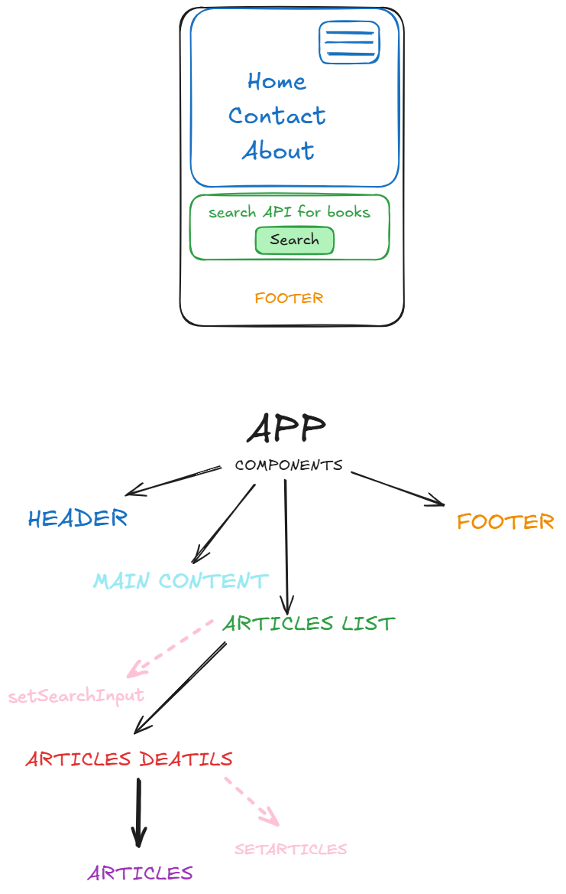

Notes: 
(1) I have setup the Repository on GitHub. 
(2) I have installed and created the cors on my back-end repo project. 
(3) I have created a wireframe and planned my components, note: Authentication is going to be one of the last things I do on the project. 
(4) I created a button that outputs the API data to screen on another page, viewing a list of all articles. 
(5) I created a page that allows views of an individual article when the link is pressed. 
(6) I added CSS (mobile first) to the code. 
(7) I implemented the list of comments associated with each article in the API. I added code to the ArticlesDetails file including a new API to fetch the comments. I then created a map to loop through the API. 
(8) I used bootstrap to design a card for each article. 
